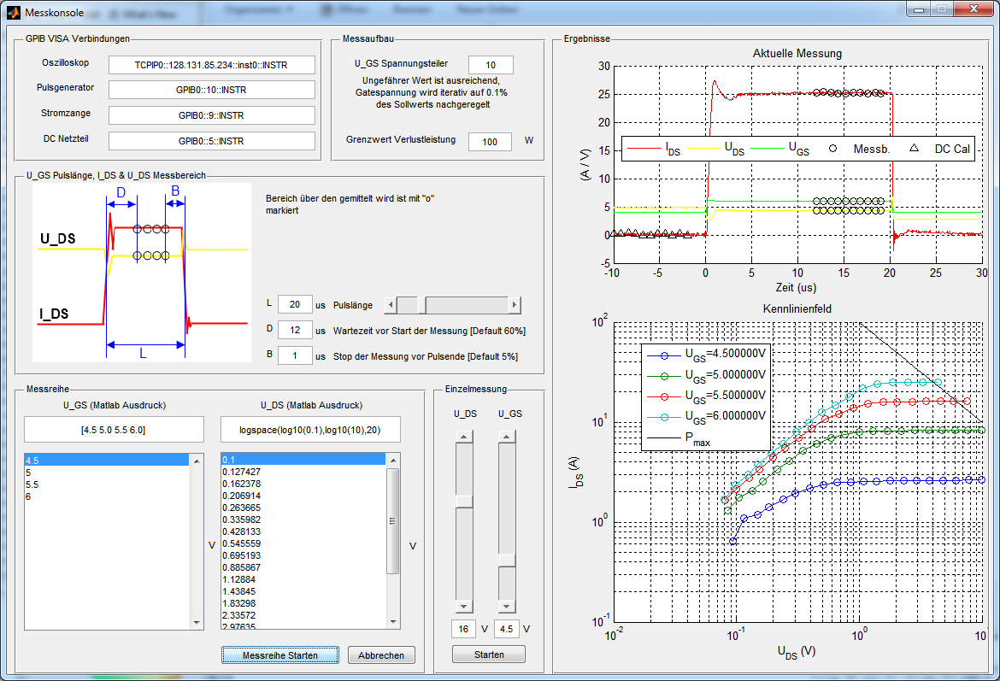
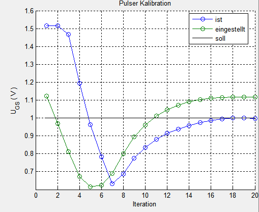
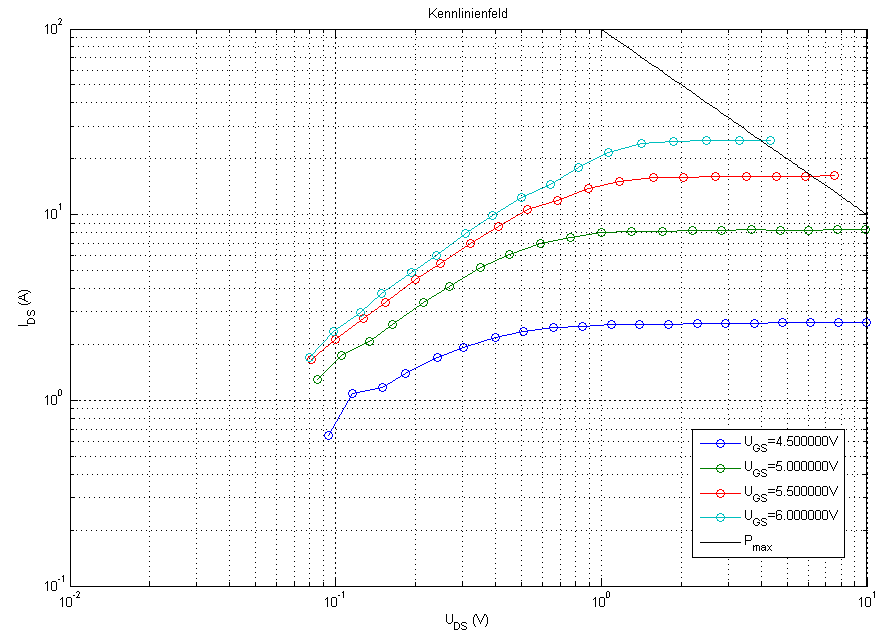

Pulsed Characteristic Curve Measurement
=======================================
pcurve is a Matlab application that measures the characteristic curve of
a transistor using short pulses. This approch reduces temperature
changes that skew the results. It comes with a few tricks
like automatic iterative pulse calibration, zeroing and nonlinearity
compensation and a sophisticated GUI.
Documentation is
available in german - see the [documentation](documentation) folder.

Instruments
-----------
pcurve was written for the following setup:
* Four channel oscillocope (Agilent 7000)
* Current probe amplifier (Tektronix AM5030)
* DC power supply (Agilent 6633B)
* Pulse generator (Avtech AVRF-2-B)

In addition, it needs a USB-GPIB adapter to communicate with the
instruments that do not have a USB or Ethernet port built-in. The
Agilent GPIB libraries are used.

User Interface
--------------

### Main window ###

### Pulse calibration ###

Results
-------
When a batch measurement finishes, the user gets the characteristic
curve displayed:

Additionally, the data points are saved into a file that is named like

	messreihe_2011_8_16_18h04m44s.mat

The structure of this file is described in the documentation. An example
dataset is included in the [example-data](example-data) folder.
